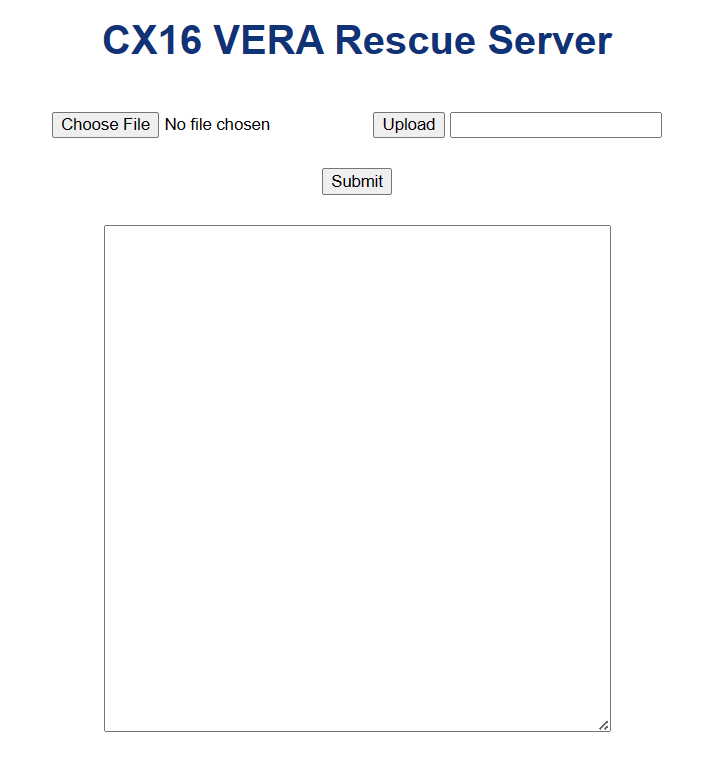

# cx16_vera_recover
A nice way to recover your Commander X16 VERA using an Arduino Nano ESP32

With this code I could recover my own CX16 VERA using an Arduino Nano ESP32.
I don't wish anyone to brick their VERA but with this tool you can recover.

The process how to do this will be documented here.

I've built 2 version of it.
- A synchronous web server implementation using Arduino IDE 2.
- An asynchronous web server implementation using PlatformIO. Reason of platform IO is the necessity to be abe to create index.html and style.css files (maybe later more) as part of the project. And PlatformIO has built-in facilities to do exactly that.

# ASNCHRONOUS WEB SERVER

 - Consult the [cheat sheet](https://docs.arduino.cc/tutorials/nano-esp32/cheat-sheet) of the Arduino Nano ESP32 for more info.
 - This is a **Platform IO** repository. Install PlatformIO first from the VSCODE extensions.
 - Open the folder using the PlatformIO GUI. Click on **PlatformIO icon**, then open **Quick Access > PIO Home > Open**.
 - After opening, PlatformIO will scan the folder.
 - The `platformio.ini` file is very important. It contains the settings how the Arduino Nano ESP32 will be flashed.
 - An other important file is `app3M_spiffs9M_fact512k_16MB.csv`, it is used to define the partitions of the Arduino Nano ESP32.
 - The solution requires a **SPIFFS file partition** to be filled with data (index.html, style.css and the like).
     - You will find these files in the data folder in the **CX16-VERA-RESCUE-ASYNC > data folder**.
     - Install using **Project Tasks > arduino_nano_esp32 > Upload Filesystem Image**.
     - Before you install, ensure you **put the Arduino Nano in 
       [bootloader](https://support.arduino.cc/hc/en-us/articles/9810414060188-Reset-the-Arduino-bootloader-on-the-Nano-ESP32) mode**! 
       Use a female/female jumper cable to connect the GND PIN with the B1 PIN. You should see a green led. 
       Then press the reset button once, you'll hear a sound, and then unplug the jumper cable from one of the PINs. 
       A purple led should light up.  
     - In the `platformio.ini` file, uncomment the line `; upload_protocol = esptool` ( Delete the `;` ).
     - You'll see that in **Project Tasks** the menu options seem to dissapear, but they will come back after a while!
     - Once the **Project Tasks** menu options return, click on **Project Tasks > arduino_nano_esp32 > Upload Filesystem Image**.
       The file system for the data will be created, and will be uploaded using the esptool.
       It needs the `COM6` port of the Arduino Nano ESP32 to flash the **SPIFFS partition** containing the data.
       You'll see a lot of verbose logs, and observe the interesting messages.
     - Once the SPIFFS partition has been flashed onto the Arduino Nano ESP32, press the reset button the device.
 - The solution hosting the web server also needs to be built (compiled and uploaded onto the Arduino Nano ESP32).
     - Comment the line `upload_protocol = esptool` in the `platformio.ini` file, by placing a `;` in the front again.
     - The Platform IO workspace will rescan again the whole project and the **Project Tasks** will reappear after a while.
     - Now click on **Project Tasks > arduino_nano_esp32 > Build**.
     - Once done, click on **Project Tasks > arduino_nano_esp32 > Upload**.
     - The upload happens with the ´DFU tool´, which uses the `COM7` port of the Arduino Nano ESP32. No bootloader mode is required.
 - Once the build has happened, it should run the web server on your Arduino Nano ESP32.
 - It hosts a WIFI provisioning solution. Find in your WIFI on your computer an ConnectAP SSID, and connect.
 - A web page should open from where you can select your WIFI SSID and enter your password.
 - Once this is correctly done, the connection parameters will be permanently stored on the Arduino Nano ESP32.
 - Open the **Project Tasks > arduino_nano_esp32 > Monitor** ... It broadcasts the IP number in the monitor, on which the Arduino Nano ESP32 is connected to.
 - Open a browser and you should be able to connect.
 - Once the web page pops up, select the VERA.BIN file to flash.
 - Click Upload.
 - Click Update.
 - The update progress should be displayed in the box underneath.
 - Before you do that, ensure that your Arduino Nano ESP32 PINS are properly connected with the VERA header pins!
